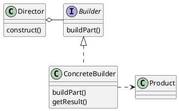
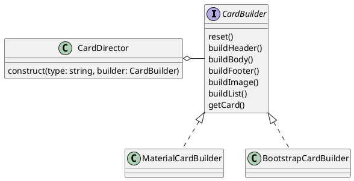

## Intent

Builder is a creational pattern providing you a construction code to produce
different types and representations of an object.

## Structure

A _Builder_ interface describes the construction pieces common to all types of
builders. A concrete implementation of that interface provides the shapes and
faces relative for that builder. A _Director_ knows how to use the pieces and
assemble the representation for the given object.



The **participants** are (Gamma, Helm, Johnson and Vlissidies, 1994, p. 99):

Builder
: Specifies an abstract interface for the creating parts of a Product object.

ConcreteBuilder
: Knows how to build individual pieces by implementing the Builder interface.

Director
: Constructs an object using the Builder interface.

Product
: The complex object that is represented with the Builder interface. The product
knows its internal representation and includes classes that define the
constituent parts, including interfaces for assembling parts to the final result.

### Object Oriented Implementation



On top of it a _Director_ can be used, that knows how to call the `build*` in
the correct order. Here is how:

```ts
class CardDirector {
  construct(type: string, builder: CardBuilder) {
    builder.reset();

    switch (type) {
      case "simple":
        builder.buildBody();
        break;

      case "dialog":
        builder.buildHeader();
        builder.buildBody();
        builder.buildFooter();
        break;
    }

    return builder.getCard();
  }
}
```

### Declarative Implementation

A <LinkTo
@route="component-architecture.types.contextual">contextual
component</LinkTo> is best suited to implement the builder pattern
declaratively. The yielded elements are pieces to construct different
shapes of a particular type. The contextual component can act as a director
itself with the _simple_ case being the default. The participants mentioned
above are spread a bit differently and are as follows:

Builder
: The builder interface defines the `yield` of a concrete builder component.
Since this is not officially supported in ember, typescript can help here to let
us define an interface for it, yet apart from documentation purpose there is no
other benefit from doing so (see `component.ts` below).

ConcreteBuilder
: The component, that yields in regards to the builder interface.

Director
: Can be the _ConcreteBuilderComponent_ itself or a separate component, that
wraps the Builder, see subsection [Using a Director](#using-a-director) below.

Product
: The object being represented by the with the _ConcreteBuilder_, see
subsection [Using a Director](#using-a-director) below.

<Tabs as |tabs|>
<tabs.Page @title="template.hbs">
<CodeSnippet @name="components/card/template.hbs" />
</tabs.Page>

<tabs.Page @title="component.ts">
<CodeSnippet @name="components/card/component.ts" />
</tabs.Page>

<tabs.Page @title="body/template.hbs">
<CodeSnippet @name="components/card/body/template.hbs" />
</tabs.Page>
</Tabs>

Remark: header, footer and body have the same template, only the css class is
different (that's why there is only one template shown).

The simplest use-case (since it is a conceptual component, we give it
a sensible default):

<Demo @source="components/patterns/builder/demo-simplest.hbs">
<Card>
Simplest Card
</Card>
</Demo>

Using the pieces from the builder:

<Demo @source="components/patterns/builder/demo-dialog.hbs">
<Card as |cb|>
<cb.Header>
Header
</cb.Header>
<cb.Body>
Card body
</cb.Body>
<cb.Footer>
Footer
</cb.Footer>
</Card>
</Demo>

The _Director_ is optional, since the `<Card>` is one itself (for the default case),

#### Future Additions

This pattern allows for future additions, without breaking the existing code.

1. Adding more elements by extendng the `<Card>` with a `<Card::List>` component
   to provide a piece for lists within a card. Even further the list can be a
   builder pattern on its own, yielding prieces to create individual items.

2. Exchanging the UI part. In the given example, the `<Card>` component is used,
   which can be easily replaced with another component, e.g. `<MaterialCard>` as
   long as both implement the `CardYield` interface.

   Combine it with the <LinkTo @route="component-architecture.patterns.strategy">strategy
   pattern</LinkTo> to pass in the respective builder components.

#### Using a Director

Using the `<CardDirectory>` as a wrapper to take the `@builder` as input and
yield the ready-to-use variable to construct your own object.

```hbs
<CardDirector @builder={{component "material-card"}} as |cb|>
  <cb.Header>...</cb.Header>
  ...
</CardDirector>
```

The tradeoff here is, the logic to control the order is not be part of the
`<CardDirector>` itself but must still be handled from within the context. The
`<CardDirector>` as its own component is only the passthrough from passed in `@builder`.

Better approach is to integrate the _director_ as part of the context, e.g. a
component handling business logic depending on the object being passed in:

```hbs
<ProductCard @product={{@product}} />
```

The `<ProductCard>` will become the director and depending on the `@product`
knows how to assemble the pieces in the correct order to accordingly represent
the product.

## Applicability

- Use the builder pattern when you want to be able to create different shapes
  and representations.
- Works in harmony with the <LinkTo @route="component-architecture.types.contextual">contextual
  component</LinkTo>.
- Nesting works smoothly on the declarative approach.
- Easily extendable with more pieces.

## References

<References class="references" as |l|>
<l.WebPage @title="Builder" @url="https://refactoring.guru/design-patterns/builder"
as |r|>
<r.Author @given="Alexander" @family="Shvets"/>
</l.WebPage>
<l.Book @title="Design Patterns" @publisher="Addison-Wesley" @year="1994" as |r|>
<r.Author @given="Erich" @family="Gamma"/>
<r.Author @given="Richard" @family="Helm"/>
<r.Author @given="Ralph" @family="Johnson"/>
<r.Author @given="John" @family="Vlissides"/>
</l.Book>
</References>
