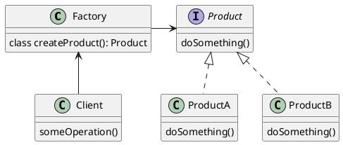
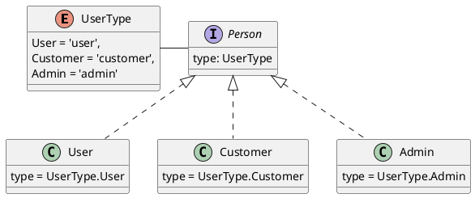

The factory pattern has different variations, called
_factory, creation method, static creation/factory method, simple
factory, factory method_ or _abstract factory_ (see [factory
comparison](https://refactoring.guru/design-patterns/factory-comparison) by
Shvets (n.d.)).

In this article, the **simple factory** is described.

## Intent

The simple factory pattern is described as an with creation method
that instantiates a new object based on passed parameters.

## Structure



### Object Oriented Programming

In OOP the pattern described, will just be a class with a static creation
method, see the `UserFactory` from Refactoring Guru (n.d.) is been used as an example.



```ts
class UserFactory {
  public static function create(type) {
    switch (type) {
      case UserType.User: return new User();
      case UserType.Customer: return new Customer();
      case UserType.Admin: return new Admin();
      default:
          throw new Exception('Wrong user type passed.');
    }
  }
}
```

### Declarative Way

A `User` object (created the way mentioned) above is about to be shown in a
`<UserProfile>` component, which has different fields given the various types.

```hbs
{{!-- components/user-profile/template.hbs}}
{{#let (component (concat 'user-profile/' @user.type)) as |Profile|}}
  <Profile @user={{@user}}/>
{{/let}}
```

with the invocation:

```hbs
<UserProfile @user={{@user}}/>
```

The `<UserProfile>` component becomes the **simple factory** by using the `type`
of a `User` object to distinguish which specific subcomponent to "create".

## Applicability

- Use it to create components to an object that has a dynamic type.
- Perfectly usable on a list/stream of those objects.

## References

<References class="references" as |l|>
<l.WebPage @title="Factory Comparison" @url="https://refactoring.guru/design-patterns/factory-comparison" as
|r|>
<r.Author @given="Alexander" @family="Shvets"/>
</l.WebPage>
</References>
