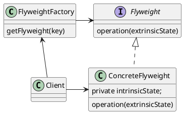

## Intent

## Structure

```plantuml
@startuml
class FlyweightFactory {
  getFlyweight(key)
}

interface Flyweight {
  operation(extrinsicState)
}

class ConcreteFlyweight implements Flyweight {
  private intrinsicState;

  operation(extrinsicState)
}

class Client

Client -up-> FlyweightFactory
FlyweightFactory  -right-> Flyweight
Client -right-> ConcreteFlyweight

@enduml
```
