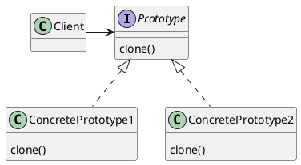
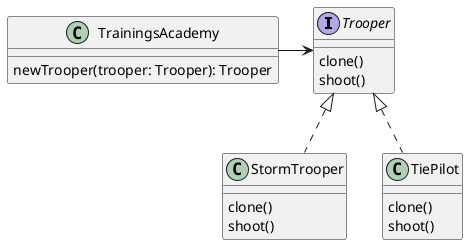

## Intent

"Prototype is a creational design pattern that lets you copy existing objects
without making your code dependent on their classes" (Shvets, n.d.).

## Structure

The client is able to clone from everything that implements the prototype
interface. A concrete implementation of the prototype pattern clones the actual
object in question and with that it can handle process related tasks, such as
managing references.



The **participants** are (Gamma, Helm, Johnson and Vlissidies, 1994, p. 119):

Prototype
: Declares an interface for cloning itself.

ConcretePrototype
: Implements an operation for cloning that object.

Client
: Creates a new object by asking the prototype to clone itself.

### Object Oriented Implemetation

For our example implementation we are on Camino and build a
trainings academy for new troopers. When it's time for new troopers, we clone
from alreay existing ones and let them grow - "_begun the clone war has_" (Yoda).



A trooper can be cloned and shoot (and always ever miss).

### Declarative Implementation

We bend the vocabulary a little in the terms, that the _prototype_ interface is
represented as a component, that _clones_ in the concrete component depending
on some business logic. The class figures out, which component to _clone_ and
the actual cloning process is invoking that component with the respective
arguments from the template. The participants vary from the imperative
implementation:

Prototype
: A component knowning which concrete component to clone (based on business
logic).

ConcretePrototype
: Specific component that will be copied over.

Client
: Template or another component invoking the prototype component.

As an example, the trainings academy shows dashboards for their education
program. One piece of that is to display the profile of a trooper to showcase
the skills and experience he achieved (so we can asure, he never
actually hit anything during his training). For that profile component, we expect
the `Trooper` (from above) being passed in as an argument:

```ts
// components/trooper-profile/component.ts

// we'll export this interface as we expect sub-components to use it for their args, too.
export interface TrooperProfileArgs {
  trooper: Trooper;
}

export default class TrooperProfileComponent extends Component<TrooperProfileArgs> {
  isTiePilot: boolean = false;

  constructor(owner: Owner, args: TrooperProfileArgs) {
    super(owner, args);

    // here is the display logic, that determines which component later on should be cloned in
    this.isTiePilot = args.trooper instanceof TiePilot;
  }
}
```

```hbs
{{!-- components/trooper-profile/template.hbs --}}
{{#if this.isTiePilot}}
  <TrooperProfile::TiePilot @trooper={{@trooper}}>
{{else}}
  {{!-- storm troopers are the default --}}
  <TrooperProfile::StormTrooper @trooper={{@trooper}}>
{{/if}}
```

with the invocation:

```hbs
<TrooperProfile @done={{this.trooper}} />
```

In this case, we used the prototype pattern both on an object oriented and
declarative level. That doesn't come as a suprise, instead it is a very
beneficial advancing from imperative to declarative programming and transport
over ideas (though it doesn't always have to be that way).

## Discussion

The reason for the declarative code being named/following the prototype pattern
is a bit far and truly is. It's based on the fact an _unknown_ component is
copied into place for the actul component being invoked.
Naming it _prototype_ is the most weak part of this.

It's also very much related to the <LinkTo
@route="component-architecture.patterns.factory">Factory
Pattern</LinkTo>. The difference between the two are, the _prototype pattern_
has the logic on the class, the _factory pattern_ has the logic on the template.

## Applicability

Gamma, Helm, Johnson and Vlissidies (1994, p. 118) state the applicability for
the prototype pattern as "use the Prototype pattern when a system should be
independent of how products are created, composed and represented". Replacing
"producs" for "components" in this example, is exaclty how this pattern can be
applied on a declarative level:

- Running A/B tests and show either variation and no change from the outside.
- Quality gates in place that direct to different variations.
- Feature switches controlling different flows.
- Displaying data/objects but which components are responsible for it, doesn't
  matter from the invoking side.

## Examples

As Camino and trainings academy make up a very nice way to demonstrate this,
this section focuses on some more real-world examples.

### Experiments

As mentioned in the [applicability](#applicability) section above, running A/B
tests is what happens very frequently these days. We create the code for all the
variations and want to be able to delete code for all loosing variants
afterwards. Using a prototype pattern here to invoke the concrete component for
that particular variant is a perfect fit for this situation as most of the time
the the variant and the component to that are unknown upfront.

In this example we are running an A/B tests for a login form. The tests contains
an experiment and a control variation. We do have an experiment service from
which we can retrieve the variation for the current visitor.

At first the class of the component will call the experiment service to
determine the variation for the running experiment. Since this is the initial
state of the component, we will set it in the constructor.

```ts
// components/login-form/component.ts
interface LoginFormArgs {
  done: () => void;
}

export default class LoginFormComponent extends Component<LoginFormArgs> {
  experiment: boolean = false;

  constructor(owner: Owner, args: LoginFormArgs) {
    super(owner, args);

    const experimentsService = owner.lookup("service:experiments");
    this.experiment =
      experimentsService.getVariation("login-form") === "experiment";
  }
}
```

Once we know, we instruct the template to _copy over_ the selected variation:

```hbs
{{! components/login-form/template.hbs }}
{{#if this.experiment}}
  <LoginForm::Experimental @done={{@done}} />
{{else}}
  <LoginForm::Control @done={{@done}} />
{{/if}}
```

with the invocation:

```hbs
<LoginForm @done={{this.goToDashboard}} />
```

From the invocation side, it's unknown which variation will be displayed and
that's totally fine. We don't make the code on this side dependent on which
variation it will be, this responsibility is passed to the `<LoginForm>`
component, which is the perfect owner for this. From the invocation side, it
feels like, the concrete component got cloned into the view.

## References

<References class="references" as |l|>
<l.WebPage @title="Prototype" @url="https://refactoring.guru/design-patterns/prototype" as
|r|>
<r.Author @given="Alexander" @family="Shvets"/>
</l.WebPage>

<l.Book @title="Design Patterns" @publisher="Addison-Wesley" @year="1994" as |r|>
<r.Author @given="Erich" @family="Gamma"/>
<r.Author @given="Richard" @family="Helm"/>
<r.Author @given="Ralph" @family="Johnson"/>
<r.Author @given="John" @family="Vlissides"/>
</l.Book>
</References>
