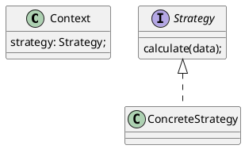

## Intent

The strategy pattern is a family of algorithms, each one encapsualted and by
that interchangeable to the receivers (Gamma, Helm, Johnson & Vlissides, 1994,
p. 315; Shvets, n.d.).

## Structure

The strategy interface defining the algorithms, a context calling the algorithms
of that interface implemented by a concrete strategy.

### Object Oriented Way

A `Client` instantiates a `ConcreteStrategy` and passes it to the `Context`.
The `Context` is receving any `Strategy` that fulfills the interface.



```ts
class Client {
  run() {
    const strategy = new ConcreteStrategy();
    const ctx = new Context();
    ctx.strategy = strategy;
  }
}
```

### Declarative Way

It's similar on a pure declarative way, where an interface describes the
arguments to take on a component level. The client invokes a component and
passes in another component (the `ConcreteStrategy`) to fulfill the contract of
arguments. To demonstrate this, typescript helps a lot:

<Tabs as |tabs|>
<tabs.Page @title="toggle/label/component.ts">
<CodeSnippet @name="components/examples/toggle/label/component.ts" />
</tabs.Page>

<tabs.Page @title="fancy-label/component.ts">
<CodeSnippet @name="components/examples/fancy-label/component.ts" />
</tabs.Page>
</Tabs>

The `ToggleLabelComponent` is the _default_ concrete strategy, implements and
provies the `ToggleLabelArgs` strategy interface. The `FancyLabelComponent`
implements the same interface for the `args` and by that, makes the default
label interchangeable. Here is how to invoke it:

```hbs
<Toggle @labelComponent={{component "fancy-label"}} />
```

For components we usually provide a decent default, that's why this component
can be used without a `@labelComponent` passed in but provides this option. More
on this example can be found in the <LinkTo
@route="component-architecture.types.composable">composable component type</LinkTo>.

### Combination of Both Ways

Combining the object oriented and declarative way can extend the usefulness of
this pattern. Instead of passing in a component as another strategy, swapping in
a javascript object containing algorithms for business logic. This way, UI and
business logic/flows can be separated and be interchangeable.

## Applicability

## References

<References class="references" as |l|>
<l.WebPage @title="Builder" @url="https://refactoring.guru/design-patterns/strategy"
as |r|>
<r.Author @given="Alexander" @family="Shvets"/>
</l.WebPage>

<l.Book @title="Design Patterns" @publisher="Addison-Wesley" @year="1994" as |r|>
<r.Author @given="Erich" @family="Gamma"/>
<r.Author @given="Richard" @family="Helm"/>
<r.Author @given="Ralph" @family="Johnson"/>
<r.Author @given="John" @family="Vlissides"/>
</l.Book>
</References>
